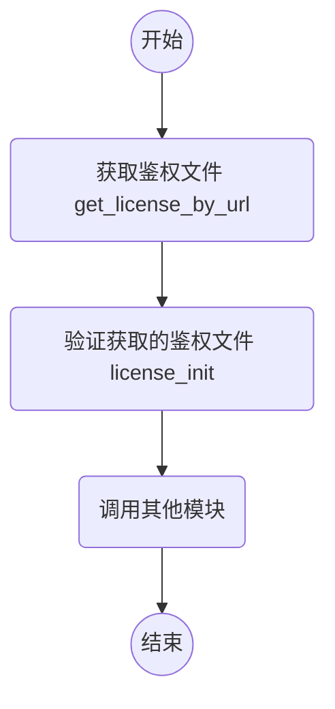

# 微众银行人脸鉴权文档

> 验证鉴权文件

version: v0.6.x (SDK版本号)

## 调用流程

## 接口 - C++

### 头文件

- webank/wb_auth.h

### 参数结构体

- WBLicenseInfo
    - `status`: 状态码
    - `failed_resaon`: 鉴权状态码对应说明信息
    - `days_left`: 鉴权文件剩余有效时间

### 通用接口

- int get_license_by_url(const std::string license_path, const std::string pubkey_path, const std::string config_path)
    - @brief 在线获取鉴权文件
    - @param `license_path` 从网络获取的鉴权文件本地的存放路径
    - @param `pubkey_path` 从网络获取的公钥文件本地的存放路径
    - @param `config_path` 鉴权配置文件
    - @return 状态码，返回0代表成功获取鉴权
    
- int license_init(const std::string license_path, const std::string pubkey_path, WBLicenseInfo * wb_license_info, const std::string project_name = "default")
    - @brief 验证鉴权文件
    - @param `license_path` 鉴权文件本地存放路径
    - @param `pubkey_path` 公钥文件本地存放路径
    - @param `wb_license_info` 返回的鉴权信息
    - @param `project_name` 鉴权文件项目名，需与鉴权文件中项目名一致
    - @return 状态码，返回0代表成功鉴权

- std::string version()
    - @brief 获得 SDK 版本号，如 `v3.0.0`/`v3.0.0-beta.0`/`v3.1.1-rc.0`
    - @return 版本号

- bool is_license_authorized(WBLicenseInfo * wb_license_info)
    - @brief 判断当前鉴权状态
    - @param `wb_license_info` 鉴权信息
    - @return 是否完成鉴权

### 常见错误码

|错误码|错误原因|
| --- | --- |
|1|未找到鉴权文件|
|4|鉴权文件格式错误，非ini格式|
|5|鉴权文件某些项缺失，无法正确读取|
|7|鉴权文件已过期，超出使用期限|
|8|签名不匹配|
|9|序列号不匹配|

