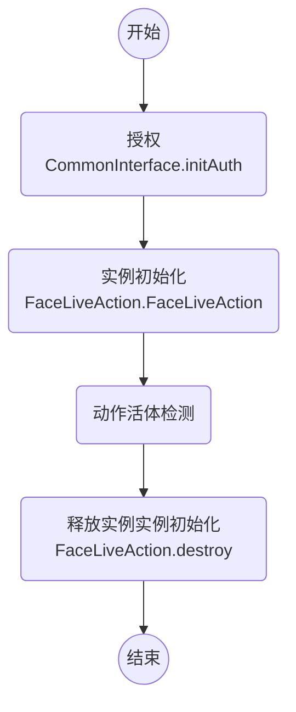

# 微众银行人脸动作活体文档 FACE-LIVE-ACTION

> 动作活体检测

version: v0.6.x(SDK版本号)

## CHANGELIST

### v0.2.3

- [更新算法] 更新摇头和点头检测算法

## 调用流程

## 接口 - Java

package: webank.com.faceliveaction.FaceLiveAction

### 通用接口

- FaceLiveAction();
    - @brief 实例初始化

- void destroy();
    - @brief 每一个 new 出的实例，都需要明确的 destroy()。防止内存泄漏。

- static String getVersion();
    - @brief 获得 SDK 的版本号，如`v3.0.0`
    - @return 版本号

### 功能接口（**多线程不安全**）
- int Blink(boolean has_face, int[] face_bbox, float[] face_landmarks)
    - @brief 是否眨眼，(**连续视频中每帧都需要调用此函数，保证输入人脸为同一个人脸，当人脸切换时应调用`Reset("blink")`函数重置**)
    - @param `has_face` 当前帧是否有人脸
    - @param `face_bbox` 人脸框(x1, y1, x2, y2)坐标。`has_face`为false时， 输入`null`；否则，输入4维数组
    - @param `face_landmarks` 人脸106关键点位置。`has_face`为false时， 输入`null`；否则，输入212维数组
    - @return 是否眨眼，0表示眨眼

 - int Mouth(boolean has_face, int[] face_bbox, float[] face_landmarks)
    - @brief 是否张嘴，(**连续视频中每帧都需要调用此函数，保证输入人脸为同一个人脸，当人脸切换时应调用`Reset("mouth")`函数重置**)
    - @param `has_face` 当前帧是否有人脸
    - @param `face_bbox` 人脸框(x1, y1, x2, y2)坐标。`has_face`为false时， 输入`null`；否则，输入4维数组
    - @param `face_landmarks` 人脸106关键点位置。`has_face`为false时， 输入`null`；否则，输入212维数组
    - @return 是否张嘴，0表示张嘴

 - int Shake(boolean has_face, float yaw)
    - @brief 是否摇头，(**连续视频中每帧都需要调用此函数，保证输入人脸为同一个人脸，当人脸切换时应调用`Reset("shake")`函数重置**)
    - @param `has_face` 当前帧是否有人脸
    - @param `yaw`度数， `has_face`为false时， 输入0
    - @return 是否摇头，0表示摇头

 - int Nod(boolean has_face, float pitch)
    - @brief 是否点头，(**连续视频中每帧都需要调用此函数，保证输入人脸为同一个人脸，当人脸切换时应调用`Reset("nod")`函数重置**)
    - @param `has_face` 当前帧是否有人脸
    - @param `pitch`度数， `has_face`为false时， 输入0
    - @return 是否点头，0表示点头

- int Reset(String mode)
    - @brief 重置状态
    - @param `mode` 可取`blink`, `mouth`, `shake`, `nod` 和 `all`, 分别表示重置相应接口状态，`all`表示重置所有接口状态
    - @return 是否重置成功，0表示成功，其他表示失败（输入字符串错误）

