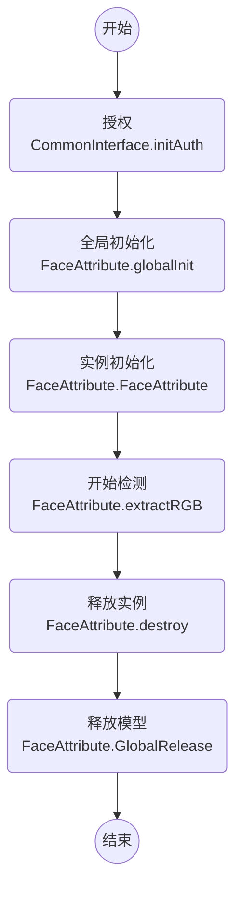

# 微众银行人脸特征文档 FACE-ATTRIBUTE

> 对输入的人脸图片进行性别、是否戴口罩、年龄属性提取

version: v0.6.x-v0.3.0 (SDK版本号-模型版本号)

## CHANGELIST

### v0.4.1

- [更新接口] 输入bbox接口改为输入xy5points

## 调用流程

## 接口 - Java

package: webank.com.faceattribute.FaceAttribute

### 参数类

- FaceAttribute.OutAttribute
    - `genderMaleProbability`: [0, 1]，男人的概率，‘genderFemaleProbability’ = 1.0f - ‘genderMaleProbability‘
    - `wearMaskProbability`: [0, 1]，戴口罩概率
    - `age`: [0, 100]
    - wearHatProbability: [0, 1]，戴帽子概率
    - wearGlassesProbability: [0, 1]，戴眼镜概率

### 通用接口

- static int globalInit(String dirPath, String configFilename);
    - @brief 全局初始化函数，初始化模型，进程初始化一次即可，多线程不安全
    - @param `dirPath` 模型所在外部存储空间的绝对路径
    - @param `configFilename` 路径`dirPath`下 config 文件名，如 `config.ini`，确保`dirPath + / + configFilename`文件存在
    - @return `< 0` 失败

- static int globalInit(AssetManager assetManager, String dirPath, String configFilename);
    - @brief (**只有android系统有效**)全局初始化函数，初始化模型，进程初始化一次即可，多线程不安全
    - @param `assetManager` Android 管理 `Assets` 类，可通过 `this.getAssets()` 获得
    - @param `dirPath` 模型所在 `Assets` 存储下的相对路径
    - @param `configFilename` 模型所在 `Assets` 存储下的相对路径下 config 的文件名，如 `config.ini`
    - @return `< 0` 失败

- static void globalRelease();
    - @brief 全局析构函数，进程结束析构一次即可，多线程不安全

- FaceAttribute();
    - @brief 实例初始化 (**实例初始化前必须先全局初始化**)

- void destroy();
    - @brief 每一个 new 出的实例，都需要明确的 destroy()。防止内存泄漏。

- static String getVersion();
    - @brief 获得 SDK + MODEL 的版本号，如`v3.0.0-v7114`
        - MODEL 的版本号由 `config.ini` 中读取获得
        - SDK 的版本号一般为 `v3.0.0`/`v3.0.0-beta.0`/`v3.1.1-rc.0`
    - @return 版本号

### 功能接口（**多线程安全**）

- FaceAttribute.OutAttribute extractRGB(float[] xy5Points, byte[] rgbData, int width, int height, int flag);
    - @brief 根据输入的人脸框和图片数据，提取人脸属性
    - @param `xy5Points` 人脸关键五点横纵坐标，(左眼，右眼，鼻尖，左嘴角，右嘴角)；不能为空，数组长度=`10`
    - @param `rgbData` 输入 RGB 图像数据；不能为空，数组长度=`width*height*3`
    - @param `width` 输入 RGB 图像 宽
    - @param `height` 输入 RGB 图像 高
	- @param `flag` 输入图像旋转系数，只能取1,2,3,4,5,6,7,8八个值，1为不旋转
    - @return 人脸属性

- FaceAttribute.OutAttribute extractYUV(float[] xy5Points, byte[] yuvData, int width, int height, int flag);
    - @brief 根据输入的人脸框和图片数据，提取人脸属性
    - @param `xy5Points` 人脸关键五点横纵坐标，(左眼，右眼，鼻尖，左嘴角，右嘴角)；不能为空，数组长度=`10`
    - @param `yuvData` 输入 YUV 图像数据；不能为空，数组长度=`width*height*1.5`
    - @param `width` 输入 YUV 图像 宽
    - @param `height` 输入 YUV 图像 高
	- @param `flag` 输入图像旋转系数，只能取1,2,3,4,5,6,7,8八个值，1为不旋转
    - @return 人脸属性