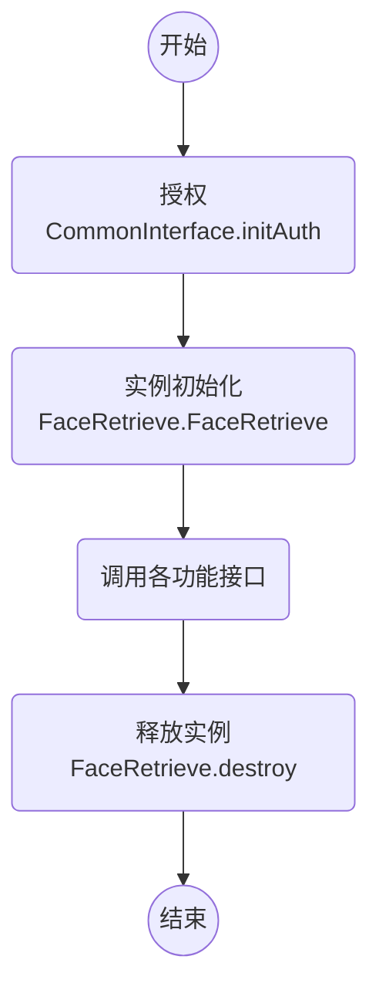

# 微众银行人脸检索 FACE-RETRIEVE

version: v0.6.x (SDK版本号)

## CHANGELIST

### v0.5.0

- [更新接口] 库id由int改为String

### v0.2.4

- [更新错误码]

## 名词解释

- `feat` 特征 `feature` 的简写，特征为一维数组，每一维为一个浮点小数。比如：每张人脸的特征可以表示为特征长度为 512 个 float 组成的一个 float[] 向量，即特征向量。
- `featLength` 特征向量长度，不同的**人脸特征SDK**对应提取的特征长度可能不一致，目前最稳定的为 512 维，还可能为 1024/128/512 维
- `featId` 每一个特征向量对应唯一标识符
- `sim` 两个特征向量的欧式距离
- `score` 将 `sim` 转换成 [0, 100] 的分数
- `norm` 归一化，**所有的特征在进行计算前，都必须要归一化**，归一化能够极大的提高运算效率。特征归一化有多种方式，目前使用的的归一化方法为：[缩放到单位长度 Scaling to unit length](https://en.wikipedia.org/wiki/Feature_scaling#Scaling_to_unit_length)

```bash
# 对于特征向量 x
x = (x1, x2, x3, ..., xn)
# 求取其平方和，并开根号
sum = sqrt(x1*x1 + x2*x2 + x3*x3 + ... + xn*xn)
# 每一维除以 sum，即可得到归一化之后的特征向量
x_norm = (x1/sum, x2/sum, x3/sum, ..., xn/sum)
```

## 调用流程


注意：特征向量一定要先归一化，然后按照对应 id 的顺序拼接而成

以 java 为例：

```java
// 0. 确定 **人脸特征SDK** 的要素：特征长度 `featLength`。
int FEATURE_LENGTH = 512;

// 1. 使用 `featLength`，创建对应的 `FaceRetrieve` 的实例。
// retriever 内所有的 lib 特征长度均为 `featLength`
FaceRetrieve retriever = new FaceRetrieve(featLength);

// 2. 自定义库的 id，并创建，创建时候可以包含特征
String DO_SOMETHING_LIB_ID = 1;
boolean result = faceRetrieve.createLib(null, null, DO_SOMETHING_LIB_ID);
// or
// 特征向量一定要先归一化，然后按照对应 id 的顺序拼接而成
// 对于移动端 FaceFeature 提取的特征已经完成了归一化
// feats = getSomeFeats();
// featIds = getSomeFeatIds();
// boolean result = faceRetrieve.createLib(feats, featIds, DO_SOMETHING_LIB_ID);

// 3. 检索，从对应 lib 中，对输入的单条特征进行检索，获得 topN 相似度的 lib 中的特征结果
String[] libs = {DO_SOMETHING_LIB_ID};
int topN = 3;
float threshold = 0.8;
// float[] toRetrieveFeat = getRetrievedFeat();
FaceRetrieve.RetrievedFace[] results = faceRetrieve.retrieve(libs, topN, toRetrieveFeat, threshold);
if (results == null || results.length == 0) {
    Log.i("webank", "no results");
}

// 4. CRUD，可以调用其他接口，对 lib 中的特征进行增删改查，具体请看接口文档
```

## 数据结构

注意：特征向量一定要先归一化，然后按照对应 id 的顺序拼接而成

每一个 **人脸特征SDK** 对于人脸特征的提取，都有对应的特征向量长度，`featLength`。以下以 `featLength = 512` 举例。

```java
int featLength = 512;

// 单个特征向量
feat: [float, float, float, ..., float]
feat.length = featLength

// 多个特征向量对应关系
feats  : [  512,     512,     512,   ...,   512 ]
featIds: [FeatId1, FeatId2, FeatId3, ..., FeatIdN]

float[] feats = new float[featIds.length * featLength];

System.arraycopy(feat, 0, feats, n * featLength, featLength);
```

## 接口 - Java

package: webank.com.faceretrieve.FaceRetrieve

### 参数类

- class RetrievedFace;
    - String featId: 检索得到的 feat id
    - String libId: 检索得到的 lib id
    - float score: 分数，取值范围 [0-1]

### 通用接口

- FaceRetrieve(int featLength);
    - @brief 实例初始化
    - @param `featLength` 特征的长度，取决于**人脸特征SDK**提取的特征维度

- void destroy();
    - @brief 每一个 `new` 出的实例，都需要明确的 `destroy()`。防止内存泄漏。

- static String getVersion();
    - @brief 获得 SDK 版本号，如 `v3.0.0`/`v3.0.0-beta.0`/`v3.1.1-rc.0`
    - @return 版本号

### 功能接口（**多线程不安全**）

- float compare(float[] feat0, float[] feat1, boolean isCentile);
    - @brief 比对两个人脸特征
    - @param `feat0` 人脸特征；不能为空，数组长度=`featLength`
    - @param `feat1` 人脸特征；不能为空，数组长度=`featLength`
    - @param `isCentile` 是否返回百分制分数，true返回百分制分数，false返回[0, 1]分数
    - @return 分数

- FaceRetrieve.RetrievedFace[] retrieve(String[] libIds, int topN, float[] feature, float threshold);
    - @brief 在指定库中检索出最相似的 topN 个人，得到符合条件的检索结果
    - @param `libIds` 待检索的库 id 数组；不能为空
    - @param `topN` 选取相似度最高的前 `topN` 个人
    - @param `feature` 待检索的人的特征；不能为空，数组长度=`featLength`
    - @param `threshold` 阈值，[0, 1]
    - @return 检索结果数组

- boolean createLib(float[] feats, String[] featIds, String libId);
    - @brief 创建一个人脸检索 1:N 的库，可以同时创建多个检索库，由 `libId` 区分
    - @brief 其中三个参数应该满足关系 `feats.length == featIds.length * featLength`
    - @brief 注意，为了性能考虑，不会对插入的 `featIds` 进行重复性校验，调用者应自行确保 `featId` 是唯一的
    - @brief 如果创建空数据库，设置`feats = null`和`feat_ids = null`
    - @param `feats` 根据 `featIds` 的顺序，将所有特征值拼接而成的 float 数组，应该满足关系 `feats.length == featIds.length * featLength`，**特征必须归一化**
    - @param `featIds` 每个特征对应的特征 id
    - @param `libId` 检索库 id，调用方自行决定，检索库的唯一标识符
    - @return 是否创建成功，比如：若 `libId` 重复，则会创建失败

- int insertFeatures(float[] feats, String[] featIds, String libId);
    - @brief 批量往检索库 `libId` 中插入指定的特征和其对应关系的特征 id
    - @brief 注意，为了性能考虑，不会对插入的 `featIds` 进行重复性校验，调用者应自行确保 `featId` 是唯一的
    - @param `feats` 根据 `featIds` 的顺序，将所有特征值拼接而成的 float 数组，应该满足关系 `feats.length == featIds.length * featLength`，**特征必须归一化**
    - @param `featIds` 每个特征对应的特征 id
    - @param `libId` 检索库 id，检索库的唯一标识符
    - @return `< 0` 失败；`= 0` 成功

- int clearLib(String libId);
    - @brief 删除指定 `libId` 的检索库
    - @param `libId` 检索库 id
    - @return `< 0` 失败；`= 0` 成功

- int clearAllLibs();
    - @brief 删除本实例内所有的检索库
    - @return `< 0` 失败；`= 0` 成功

- int deleteFeatures(String[] featIds, String libId);
    - @brief 删除指定 `libId` 中对应 `featIds` 的特征向量
    - @param `featIds` 待删除的id数组
    - @param `libId` 检索库 id
    - @return `< 0` 失败；`= 0` 成功；`> 0` lib 中不存在 `featId` 的数量；

- int updateFeature(float[] feat, String featId, String libId);
    - @brief 更新指定 `libId` 中 `featId` 对应的特征向量
    - @param `feat` 输入的新的特征向量；不能为空，数组长度=`featLength`
    - @param `featId` 特征 id
    - @param `libId` 检索库 id
    - @return `< 0` 失败；`= 0` 成功

- int getFeatureCount(String libId);
    - @brief 查询指定 `libId` 检索库中的特征数量
    - @param `libId` 检索库 id
    - @return 检索库中的特征数量

- float[] queryFeature(String featId, String libId);
    - @brief 查询指定 `libId` 检索库中指定 `featId` 的特征值
    - @param `featId` 特征 id
    - @param `libId` 检索库 id
    - @return 特征值，若 `featId` 不存在，则返回 null

### 常见错误码

```bash
ERROR_RETRIEVE_LIB_ID_EXIST -100
ERROR_RETRIEVE_LIB_ID_NOT_EXIST -101
ERROR_RETRIEVE_FEAT_ID_NOT_EXIST -102
ERROR_RETRIEVE_FEATURES_AND_IDS_UNMATCHED -103
ERROR_RETRIEVE_FEATURES_SIZE_OVERFLOW -104
ERROR_RETRIEVE_EMPTY_LIB_IDS -105
ERROR_RETRIEVE_FEAT_ID_EXIST -106
ERROR_RETRIEVE_INPUT_ARGUMENTS_WRONG -107
```
