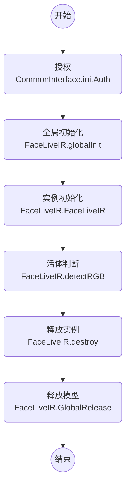

# 微众银行人脸活体-红外文档 FACE-LIVE-IR

> 输入红外图进行活体检测

version: v0.6.x-v0.3.3 (SDK版本号-模型版本号)

### 调用流程

## 接口 - Java

package: webank.com.faceliveir.FaceLiveIR

### 通用接口

- static int globalInit(String dirPath, String configFilename);
    - @brief 全局初始化函数，初始化模型，进程初始化一次即可，多线程不安全
    - @param `dirPath` 模型所在外部存储空间的绝对路径
    - @param `configFilename` 路径`dirPath`下 config 文件名，如 `config.ini`，确保`dirPath + / + configFilename`文件存在
    - @return `< 0` 失败

- static int globalInit(AssetManager assetManager, String dirPath, String configFilename);
    - @brief (**只有android系统有效**)全局初始化函数，初始化模型，进程初始化一次即可，多线程不安全
    - @param `assetManager` Android 管理 `Assets` 类，可通过 `this.getAssets()` 获得
    - @param `dirPath` 模型所在 `Assets` 存储下的相对路径
    - @param `configFilename` 模型所在 `Assets` 存储下的相对路径下 config 的文件名，如 `config.ini`
    - @return `< 0` 失败

- static void globalRelease();
    - @brief 全局析构函数，进程结束析构一次即可，多线程不安全

- FaceLiveIR();
    - @brief 实例初始化 (**实例初始化前必须先全局初始化**)

- void destroy();
    - @brief 每一个 new 出的实例，都需要明确的 destroy()。防止内存泄漏。

- static String getVersion();
    - @brief 获得 SDK + MODEL 的版本号，如`v3.0.0-v7114`
        - MODEL 的版本号由 `config.ini` 中读取获得
        - SDK 的版本号一般为 `v3.0.0`/`v3.0.0-beta.0`/`v3.1.1-rc.0`
    - @return 版本号

### 功能接口（**多线程安全**）

- float detectRGB(float[] colorXY5Points, byte[] colorDataRGB, int colorWidth, int colorHeight, int color_flag, float[] irXY5Points, byte[] irDataRGB, int irWidth, int irHeight, int ir_flag, FaceLiveIR.Image faceImage);
    - @brief 人脸 红外 活体判断打分
    - @param `colorXY5Points` 彩色图人脸关键五点横纵坐标，(左眼，右眼，鼻尖，左嘴角，右嘴角)；不能为空，数组长度=`10`
    - @param `colorDataRGB` 彩色RGB图的图像数据；不能为空，数组长度=`colorWidth*colorHeight*3`
    - @param `colorWidth` 彩色RGB图的宽
    - @param `colorHeight` 彩色RGB图的高
    - @param `color_flag` 彩色RGB图像旋转系数，只能取1,2,3,4,5,6,7,8八个值，1为不旋转
    - @param `irXY5Points` 红外图人脸关键五点横纵坐标，(左眼，右眼，鼻尖，左嘴角，右嘴角)；不能为空，数组长度=`10`
    - @param `irDataRGB` 红外RGB图的图像数据；不能为空，数组长度=`irWidth*irWidth*3`
    - @param `irWidth` 红外RGB图的宽
    - @param `irHeight` 红外RGB图的高
    - @param `ir_flag` 红外RGB图像旋转系数，只能取1,2,3,4,5,6,7,8八个值，1为不旋转
    - @param `faceImage` 转正后的IR人脸图片，供后续调用，需**调用方分配内存**；若无需使用，输入`null`
    - @return 人脸红外活体打分结果，每个分数为 0-1区间

- float detectYUV(float[] colorXY5Points, byte[] colorDataYUV, int colorWidth, int colorHeight, int color_flag, float[] irXY5Points, byte[] irDataYUV, int irWidth, int irHeight, int ir_flag, FaceLiveIR.Image faceImage);
    - @brief 人脸 红外 活体判断打分
    - @param `colorXY5Points` 彩色图人脸关键五点横纵坐标，(左眼，右眼，鼻尖，左嘴角，右嘴角)；不能为空，数组长度=`10`
    - @param `colorDataYUV` 彩色YUV图的图像数据；不能为空，数组长度=`colorWidth*colorHeight*1.5`
    - @param `colorWidth` 彩色YUV图的宽
    - @param `colorHeight` 彩色YUV图的高
    - @param `color_flag` 彩色YUV图像旋转系数，只能取1,2,3,4,5,6,7,8八个值，1为不旋转
    - @param `irXY5Points` 红外图人脸关键五点横纵坐标，(左眼，右眼，鼻尖，左嘴角，右嘴角)；不能为空，数组长度=`10`
    - @param `irDataYUV` 红外YUV图的图像数据；不能为空，数组长度=`irWidth*irWidth*1.5`
    - @param `irWidth` 红外YUV图的宽
    - @param `irHeight` 红外YUV图的高
    - @param `ir_flag` 红外YUV图像旋转系数，只能取1,2,3,4,5,6,7,8八个值，1为不旋转
    - @param `faceImage` 转正后的IR人脸图片，供后续调用，需**调用方分配内存**；若无需使用，输入`null`
    - @return 人脸红外活体打分结果，每个分数为 0-1区间
