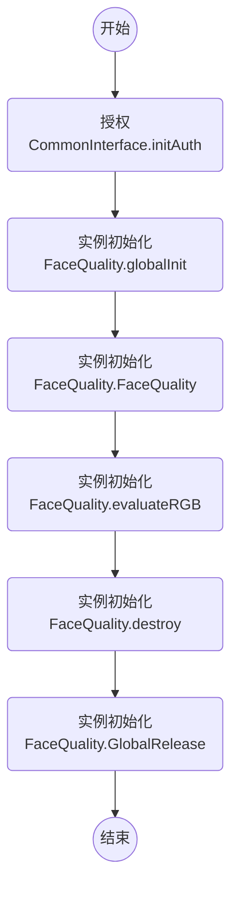

# 微众银行人脸质量文档 FACE-QUALITY

> 评估输入图片的人脸质量分，此版本主要评估正侧脸和光照强度

version: v0.6.x-v0.2.0 (SDK版本号-模型版本号)

## CHANGELIST

### v0.2.4

- [更新接口] 改为深度学习接口

## 调用流程

## 接口 - Java

package: webank.com.facequality.FaceQuality

### 参数类

- FaceQuality.OutQuality
    - `blur`:  // [0, 1]，模糊分数，越高代表越清晰
    - `front`:  // [0, 1], 正脸分数，越高代表脸越正
    - `illumination`: // [0, 1]，光照分数，越高代表光照越正常

### 通用接口
- static int globalInit(String dirPath, String configFilename);
    - @brief 全局初始化函数，初始化模型，进程初始化一次即可，多线程不安全
    - @param `dirPath` 模型所在外部存储空间的绝对路径
    - @param `configFilename` 路径`dirPath`下 config 文件名，如 `config.ini`，确保`dirPath + / + configFilename`文件存在
    - @return `< 0` 失败

- static int globalInit(AssetManager assetManager, String dirPath, String configFilename);
    - @brief (**只有android系统有效**)全局初始化函数，初始化模型，进程初始化一次即可，多线程不安全
    - @param `assetManager` Android 管理 `Assets` 类，可通过 `this.getAssets()` 获得
    - @param `dirPath` 模型所在 `Assets` 存储下的相对路径
    - @param `configFilename` 模型所在 `Assets` 存储下的相对路径下 config 的文件名，如 `config.ini`
    - @return `< 0` 失败

- static void globalRelease();
    - @brief 全局析构函数，进程结束析构一次即可，多线程不安全

- FaceQuality();
    - @brief 实例初始化 (**实例初始化前必须先全局初始化**)

- void destroy();
    - @brief 每一个 new 出的实例，都需要明确的 destroy()。防止内存泄漏。

- static String getVersion();
    - @brief 获得 SDK + MODEL 的版本号，如`v3.0.0-v7114`
        - MODEL 的版本号由 `config.ini` 中读取获得
        - SDK 的版本号一般为 `v3.0.0`/`v3.0.0-beta.0`/`v3.1.1-rc.0`
    - @return 版本号

### 功能接口（**多线程安全**）

- FaceQuality.OutQuality evaluateRGB(float[] bbox, byte[] rgbData, int width, int height, int flag);
    - @brief 获得人脸图片质量分数
    - @param `bbox` 人脸框左上和右下角坐标[x1, y1, x2, y2]；不能为空，数组长度=`4`
    - @param `rgbData` RGB图的图像数据；不能为空，数组长度=`width*height*3`
    - @param `width` RGB图的宽
    - @param `height` RGB图的高
    - @param `flag` 输入图像旋转系数，只能取1,2,3,4,5,6,7,8八个值，1为不旋转
    - @return 人脸质量

- FaceQuality.OutQuality evaluateYUV(float[] bbox, byte[] yuvData, int width, int height, int flag);
    - @brief 获得人脸图片质量分数
    - @param `bbox` 人脸框左上和右下角坐标[x1, y1, x2, y2]；不能为空，数组长度=`4`
    - @param `yuvData` YUV图的图像数据；不能为空，数组长度=`width*height*1.5`
    - @param `width` YUV图的宽
    - @param `height` YUV图的高
    - @param `flag` 输入图像旋转系数，只能取1,2,3,4,5,6,7,8八个值，1为不旋转
    - @return 人脸质量