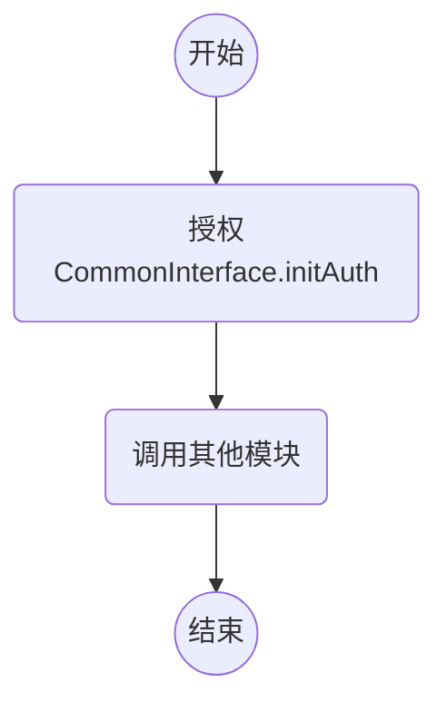

# 微众银行人脸鉴权文档 CommonInterface

> 验证鉴权文件

version: v0.6.x (SDK版本号)

## 调用流程

## 接口 - Java

package: webank.com.common.CommonInterface

### 通用接口

- static int initAuth(String licencePath, String licencePubkeyPath);
    - @brief 验证鉴权文件
    - @param `licence` 鉴权文件存放绝对路径
    - @param `licencePubkeyPath` 公钥存放绝对路径
    - @return 鉴权状态码，返回0代表鉴权成功

- static String getVersion();
    - @brief 获得 SDK 版本号，如 `v3.0.0`/`v3.0.0-beta.0`/`v3.1.1-rc.0`
    - @return 版本号

- static String getFailedReason();
    - @return 返回鉴权失败原因

- static static long getEndTime()；
    - @return 返回剩余使用天数

### 常见错误码

|错误码|错误原因|
| --- | --- |
|1|未找到鉴权文件|
|4|鉴权文件格式错误，非ini格式|
|5|鉴权文件某些项缺失，无法正确读取|
|7|鉴权文件已过期，超出使用期限|
|8|签名不匹配|
|9|序列号不匹配|

